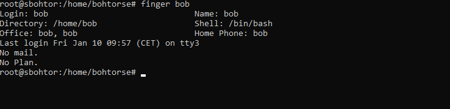
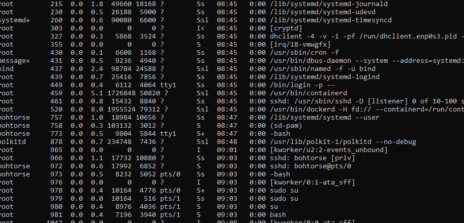
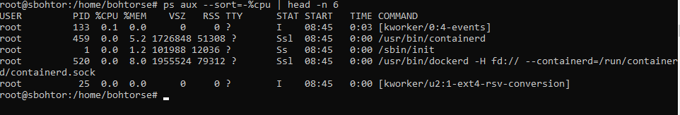
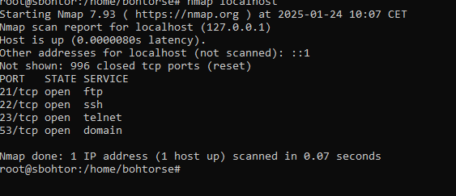
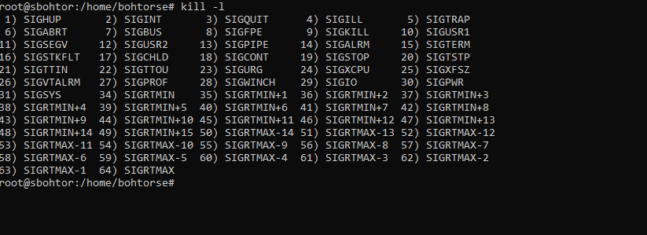
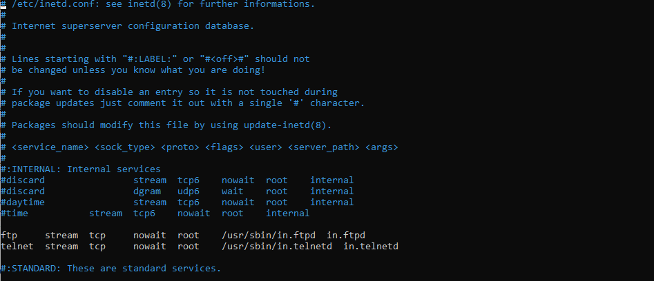
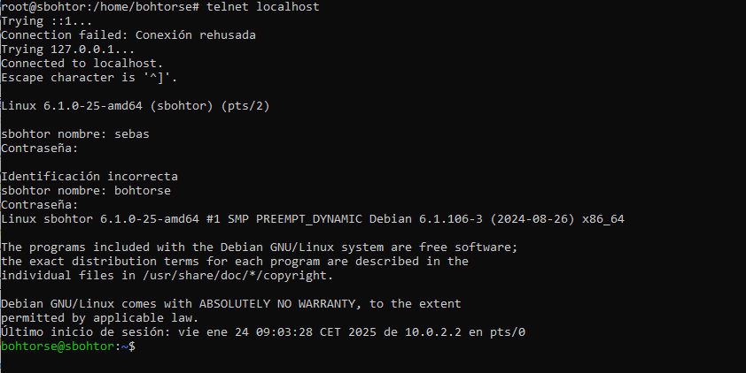
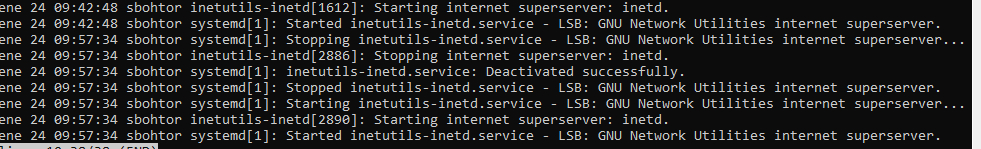

Muestra el usuario bob, en detalle.

Con el comando top o ps aux podemos ver en detalle los procesos, aunque el comando ps aux es statico mientras que el comando top u htop son tui, son interactivos, el htop es un poco mas nuevo que el top, el htop tiene colores y es un poco mas visible a la vista.

aqui hay los 5 procesos que mas consume 

**Knower-events** es un proceso de eventos del sistema.
**containerd** gestiona la ejecución de contenedores en sistemas como Docker o Kubernetes.
**init** de Docker inicia y gestiona el servicio de Docker en el sistema.
**Knower conversion** parece ser un proceso específico relacionado con la conversión de datos o un servicio en tu sistema.

El comando nmap localhost escanea la máquina local para identificar los servicios de red activos, como puertos abiertos y las aplicaciones que los utilizan. 
**FTP** (puerto 21): Protocolo para transferir archivos entre sistemas.
**SSH** (puerto 22): Protocolo seguro para acceso remoto a sistemas.
**Telnet** (puerto 23): Protocolo obsoleto para acceso remoto, no seguro.
**Domain** (puerto 53): Usado para el servicio DNS, para resolver nombres de dominio.

El comando kill -l en Linux lista todos los números de señal y sus nombres. Aquí tienes los más importantes:

Número de Señal	Nombre	Descripción
**1** **SIGHUP**	Señal de "colgar", utilizada para reiniciar un proceso o para indicar que la terminal ha sido cerrada.
**2** **SIGINT**	Señal de interrupción, generalmente enviada por Ctrl+C para detener un proceso en ejecución.
**9** **SIGKILL**	Señal de terminación forzada, termina el proceso inmediatamente sin dejarle opción de limpiar recursos.
**15** **SIGTERM**	Señal de terminación "normal", solicita a un proceso que termine de forma ordenada.
**19** **SIGSTOP**	Señal para detener (suspender) un proceso, que luego puede reanudarse.
**18** **SIGCONT**	Señal para reanudar un proceso que estaba detenido.
**14** **SIGALRM**	Señal enviada cuando un temporizador de alarma se ha activado, útil en procesos que esperan un tiempo determinado.
**3** **SIGQUIT**	Similar a SIGINT, pero además genera un volcado de memoria del proceso.

El archivo /etc/inetd.conf configura qué servicios deben ser gestionados por el inetd, un super 
servidor que inicia aplicaciones como FTP o Telnet solo cuando se reciben conexiones. 

Aunque ya el inetd se ha quedado absoleto, ahora se usa el systemd

El comando telnet localhost intenta establecer una sesión de Telnet en tu máquina local,
utilizando el puerto 23, y permite la interacción remota si el servicio telnetd está activo. 
Si la conexión falla, puede ser porque el servicio no está habilitado o inetd no está gestionándolo correctamente.

En este ultimo ejercicio podemos controlar los procesos, por ejemplo para reiniciar un proceso
usamos  kill -HUP $(pidof inetutils-inetd), esto reinicia el proceso inetd, pero esto tambien se ha 
quedado absoleto, ya que esto se ha sustituido por sistemd, con sistemctl restart "nombre del servicio" se reinicia,
con stop lo paras, start lo inicias, status para ver el estado y algunas cosas en detalle del servicio.

Esta captura es para ver en detalle cuando he parado el servicio reiniciado etc con kill.

# Sebastian Bohorquez Torres
