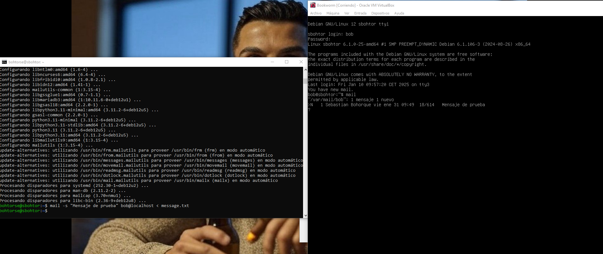
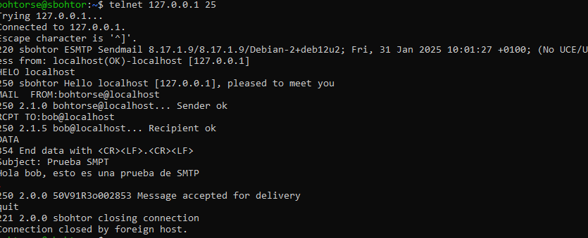

En la primera parte descargamos todo lo relacionado con mail, mailutils sendmail y si hace falta postfix, en mi caso no hacia falta, con mail-s le enviamos un correo a bob, despues entramos en la cuenta de bob ponemos mail y nos sale el email enviado.

**Ejercicio 6.3**

**Comando mail:**

**Leer correos:** Para ver los correos en tu bandeja de entrada, utiliza el comando mail.

**Responder:** Para responder un correo, abre el mensaje y usa la opción r para redactar una respuesta. Luego escribe el mensaje y presiona Ctrl+D para enviarlo.

**Enviar correo:** Para enviar un mensaje, usa el comando con el asunto y el destinatario, luego escribe tu mensaje y presiona Ctrl+D para enviarlo.

**Eliminar un correo:** Dentro de mail, usa el comando d <número> para eliminar un mensaje específico.

**Listar correos:** Usa el comando mail o mail -u bob para listar todos los mensajes de un usuario.

**Guardar un correo:** Para guardar un correo, utiliza s <número> archivo, donde <número> es el identificador del mensaje.

Contenido de /var/spool/mail/

Esta carpeta contiene los correos de cada usuario. Algunos riesgos a tener en cuenta:

Los permisos incorrectos pueden exponer los correos a accesos no autorizados.
El usuario root tiene acceso total para leer y modificar todos los correos.
Un manejo inadecuado de estos archivos podría facilitar ataques.
Para verificar los permisos de la carpeta, utiliza ls -l /var/spool/mail/.

**Envío de correos mediante Telnet (SMTP, puerto 25)**

Desde una máquina Windows, primero conéctate al puerto 25 de la máquina virtual con el comando:

telnet <ip_vm> 25

Luego, utiliza los siguientes comandos para enviar el correo:

**HELO** localhost
**MAIL FROM:** tu_nombre@localhost
**RCPT TO:** bob@localhost
**DATA**
**Subject:** Prueba

Mensaje de prueba
.
**QUIT**

Después, revisa el correo en la máquina virtual utilizando el comando mail.

**Activar POP3:**

Edita el archivo /etc/inetd.conf o /etc/xinetd.d/pop3 y descomenta la línea relacionada con POP3 si es necesario.

Guarda los cambios y reinicia el servicio con el comando sudo systemctl restart inetd.

**Conectar a POP3 con Telnet (puerto 110):**

Desde Windows, conéctate al puerto 110 de la máquina virtual:

telnet <ip_vm> 110

Los comandos básicos que puedes usar son:

**USER** bob
**PASS** <contraseña>
**LIST**
**RETR** 1
**QUIT**

Puertos usados:

**SMTP:** 25
**POP3:** 110
**IMAP (alternativa a POP3):** 143

**Ejercicio 6.4**

**IMAP vs. POP3:**

**IMAP:** Los correos permanecen en el servidor y se sincronizan en todos los dispositivos. Esto requiere más espacio en el servidor.

**POP3:** Los correos se descargan en el dispositivo y no se sincronizan entre dispositivos. Esto consume menos espacio en el servidor.

**Diferencias clave:**

**IMAP:** Los correos se mantienen en el servidor, permiten la sincronización entre dispositivos y requieren más espacio en el servidor.
POP3: Los correos se almacenan en el dispositivo local, no hay sincronización entre dispositivos y requiere menos espacio en el servidor.

**¿Qué es PGP?**

**PGP (Pretty Good Privacy)** es un sistema de cifrado para correos electrónicos que garantiza la privacidad y autenticidad del mensaje. Utiliza una clave pública para cifrar los mensajes y una clave privada para descifrarlos. Además, permite crear firmas digitales para verificar la identidad del remitente.

