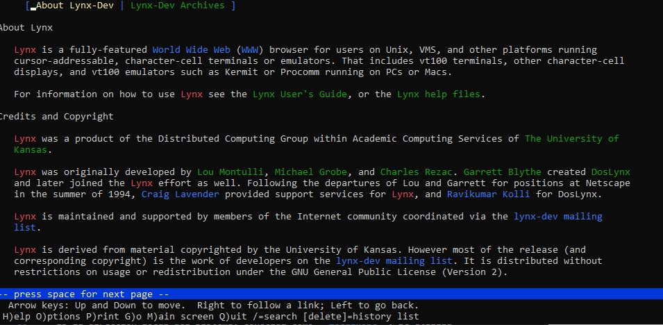

# Lab 07


# Ejercicio 7.1: Configuración de Apache

## 1. Propósito de los comentarios (`#`) en `httpd.conf`

Los comentarios se utilizan para:

- **Explicar las configuraciones:** Permiten describir el propósito y funcionamiento de las directivas sin afectar la ejecución del servidor.
- **Desactivar líneas temporalmente:** Facilitan la desactivación de ciertas configuraciones sin eliminarlas, lo que es útil para pruebas o ajustes temporales.

## 2. Valores por defecto de `ServerName` y `DocumentRoot`

- **`ServerName`:**  
  Define el nombre del servidor. Por ejemplo, puede ser `localhost` o `www.example.com`. Este parámetro se utiliza para identificar el servidor y es especialmente importante en configuraciones de hosting virtual.

- **`DocumentRoot`:**  
  Especifica la ruta del directorio donde se almacenan los archivos web que Apache servirá a los usuarios. Generalmente, este directorio es `/var/www/html` (aunque puede variar según la distribución o configuración del sistema).

## 3. Efecto de `Include /etc/httpd/mod_php.conf`

- **Carga del módulo PHP:**  
  Esta directiva incluye el archivo de configuración `mod_php.conf`, lo que permite que Apache cargue y configure el módulo PHP. Gracias a esto, el servidor puede interpretar y ejecutar scripts PHP.

# Ejercicio 7.2: Ejecutando Apache

## 1. Por qué reiniciar `httpd` tras cambios en la configuración

Es necesario reiniciar el servicio `httpd` para que Apache recargue los archivos de configuración y aplique cualquier cambio realizado, aqui podriamos usar el comando ps aux | grep httpd.


## 2. Análisis del comando `ps aux | grep httpd`

- **`ps aux`:**  
  Muestra todos los procesos en ejecución en el sistema.

- **`grep httpd`:**  
  Filtra la salida del comando anterior para mostrar únicamente las líneas que contienen la cadena "httpd", es decir, los procesos relacionados con Apache.

- **El operador `|`:**  
  Pasa la salida del comando `ps aux` como entrada del comando `grep httpd`.

## 3. Salida esperada de `ps aux | grep httpd`

- **Si `httpd` está corriendo:**  
  Se listarán varios procesos de Apache.

- **Si `httpd` no está corriendo:**  
  Solo se mostrará la línea del comando `grep httpd` (o no se mostrarán procesos relacionados con Apache).

# Ejercicio 7.3: Creando archivos HTML

## 1. ¿Qué tiene de especial `index.html`?

- **`index.html`:**  
  Es la página por defecto que carga Apache cuando no se especifica otra página en la URL.

## 2. Permisos y propietario del archivo `index.html`

Para verificar los permisos y el propietario del archivo, ejecuta el siguiente comando en la terminal:


## 3.Creando test.html
Con sudo nano /var/www/html/test.html


# Ejercicio 7.4: Viendo archivos HTML en terminal

## 1. Diferencia entre CLI y GUI

- **CLI (Interfaz de Línea de Comandos):**  
  Utiliza comandos en texto para interactuar con el sistema.

- **GUI (Interfaz Gráfica de Usuario):**  
  Ofrece una interfaz visual con elementos gráficos para la interacción.

## 2. ¿Qué tiene de especial 127.0.0.1?

- **127.0.0.1:**  
  Es la dirección local del sistema, conocida como **localhost**. Se utiliza para referirse a la máquina en la que se está trabajando, sin necesidad de usar una dirección IP externa.

## 3. Ver `test.html` en lynx

Para visualizar el archivo `test.html` utilizando el navegador de línea de comandos **lynx**, sigue estos pasos:

1. **Instalar lynx** (si no está instalado):

   ```bash
   sudo apt install lynx



# Ejercicio 7.5: Creando y viendo archivos PHP

## 1. Función de `phpinfo();`

La función `phpinfo();` muestra información detallada sobre la configuración actual de PHP. Esto incluye:
- La versión de PHP.
- Los módulos y extensiones instalados.
- Las directivas de configuración.
- Variables de entorno y otra información útil para la depuración y el ajuste del entorno PHP.

### Función de phpinfo();
Muestra información de PHP, módulos instalados y configuración.

### Ver nse.php en lynx
sudo nano /var/www/html/nse.php

lynx 127.0.0.1/nse.php


# Ejercicio 7.6: Modificando el archivo hosts

## 1. Abrir el archivo hosts

Para editar el archivo de hosts, ejecuta el siguiente comando:

nano "ruta del fichero"


Agrega 127.0.0.1 www.ejemplo.com
lynx www.ejemplo.com


