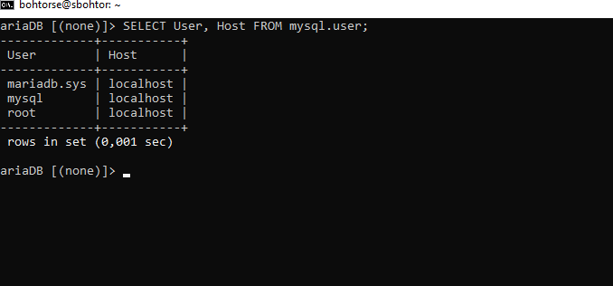

# **Ejercicio 8.1 – Gestión de Usuarios y Tablas en MySQL**  

## **Consulta de usuarios en MySQL**  
Para listar los usuarios registrados en MySQL junto con el host desde el cual pueden acceder, se usa la siguiente consulta:  

```sql
SELECT User, Host FROM mysql.user;
```


**Explicación:**  
Esta consulta devuelve una lista de los usuarios creados en el sistema MySQL, junto con la información del host desde donde pueden conectarse.

---

## **Comandos básicos para manejar tablas en MySQL**  

### **1. Crear una tabla**  
Para definir una nueva tabla con columnas específicas, utilizamos:  

```sql
CREATE TABLE SEBAS ( 
    id INT PRIMARY KEY, 
    columna1 VARCHAR(50), 
    columna2 INT 
);
```


**Nota:**  
- `id INT PRIMARY KEY` define una columna `id` como clave primaria.  
- `columna1 VARCHAR(50)` es un campo de texto con hasta 50 caracteres.  
- `columna2 INT` es una columna numérica.  

---

### **2. Eliminar una tabla**  
Si necesitamos borrar una tabla existente:  

```sql
DROP TABLE SEBAS;
```
**Advertencia:**  
Este comando elimina la tabla y todos sus datos permanentemente.

---

### **3. Consultar los datos de una tabla**  
Para ver el contenido de una tabla:  

```sql
SELECT * FROM SEBAS;
```
**Explicación:**  
Esta consulta muestra todos los registros almacenados en `SEBAS`.

---

### **4. Insertar datos en una tabla**  
Para añadir un nuevo registro:  

```sql
INSERT INTO SEBAS (id, columna1, columna2) 
VALUES (1, 'Ejemplo', 100);
```


**Ejemplo práctico:**  
Si `columna1` representa nombres y `columna2` representa edades, estamos insertando el usuario "Ejemplo" con edad "100".

---

## **Creación de la base de datos `nselab` y la tabla `users`**  

```sql
CREATE DATABASE nselab; 
USE nselab;

CREATE TABLE users ( 
    studentid INT AUTO_INCREMENT PRIMARY KEY, 
    firstname VARCHAR(25) NOT NULL, 
    lastname VARCHAR(25) NOT NULL 
);
```

**Explicación:**  
- `CREATE DATABASE nselab;` crea una nueva base de datos.  
- `USE nselab;` indica que trabajaremos en esa base de datos.  
- `AUTO_INCREMENT PRIMARY KEY` genera automáticamente un número único para cada usuario.  
- `NOT NULL` evita que los campos `firstname` y `lastname` queden vacíos.  

---

## **Inserción de datos en la tabla `users`**  

```sql
INSERT INTO users (firstname, lastname) VALUES ('Joe', 'Bloggs');  
INSERT INTO users (firstname, lastname) VALUES ('Ashley', 'Smith');
```
**Explicación:**  
Estamos agregando dos usuarios:  
1. Joe Bloggs  
2. Ashley Smith  

---


# **Ejercicio 8.2 – Creación de un Usuario con Privilegios en MySQL**  

## **Creación de un usuario con acceso a la base de datos `nselab`**  

```sql
CREATE USER 'adminsec'@'localhost' IDENTIFIED BY 'password123';  
GRANT ALL PRIVILEGES ON nselab.* TO 'adminsec'@'localhost';  
FLUSH PRIVILEGES;
```
**Explicación:**  
- `CREATE USER` crea un usuario llamado `adminsec` con la contraseña `password123`.  
- `GRANT ALL PRIVILEGES ON nselab.*` le da acceso total a la base de datos `nselab`.  
- `FLUSH PRIVILEGES;` aplica los cambios inmediatamente.  

---


## **Mostrar usuarios en una página PHP**  

**Objetivo:**  
- Conectar a MySQL desde PHP.  
- Obtener los datos de la tabla `users`.  
- Mostrar los resultados en una tabla HTML.

