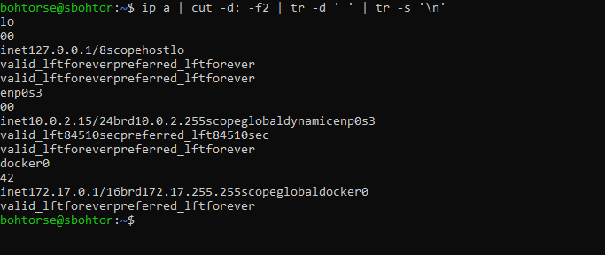
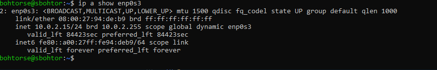
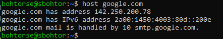

# Lab 9: Análisis de Tráfico de Red

## Imprimir la Lista de Interfaces de Red

Para listar las interfaces de red disponibles en un sistema, usa el siguiente comando:

```bash
ip a | cut -d: -f2 | tr -d ' ' | tr -s '\n'
```

### Explicación:
- `cut -d: -f2`: Divide cada línea por `:` y selecciona el segundo campo, que corresponde al nombre de la interfaz.
- `tr -d ' '`: Elimina los espacios de cada línea.
- `tr -s '\n'`: Comprime los saltos de línea para producir una lista limpia.



---

## Mostrar Direcciones IP

Para mostrar los detalles de todas las interfaces de red activas:

```bash
ip a
```

Para restringir la salida a una interfaz específica (por ejemplo, `eth0`):

```bash
ip a show eth0
```

Para extraer solo la dirección IP:

```bash
ip a show eth0 | grep inet | awk '{ print $2 }' | cut -d/ -f1
```


---

## Suplantación de Dirección MAC

Para cambiar la dirección MAC temporalmente:

```bash
ip link set eth0 address 00:1c:bf:87:25:d5
```

Nota: Este cambio solo dura hasta que se reinicie el sistema.


---

## Búsqueda de DNS

Para resolver un nombre de dominio a su dirección IP:

```bash
host google.com
```

o

```bash
nslookup google.com
```

Para agregar manualmente una entrada en `/etc/hosts`:

```bash
echo "192.168.0.9 backupserver" >> /etc/hosts
```


---

## Visualizar la Tabla de Enrutamiento

Para mostrar la tabla de enrutamiento del sistema:

```bash
ip route
```

Para agregar una puerta de enlace predeterminada:

```bash
ip route add default via 192.168.0.1 dev wlan0
```

---

## Listar Máquinas Activas en la Red

Crea un script en Bash llamado `ping.sh` con el siguiente contenido:

```bash
#!/bin/bash
# Cambia la dirección base según tu red.
for ip in 192.168.0.{1..255}; do
    ping $ip -c 2 &> /dev/null
    if [ $? -eq 0 ]; then
        echo "$ip está activo"
    fi
done
```

### Explicación:
- El script recorre las direcciones IP desde `192.168.0.1` hasta `192.168.0.255`.
- Envía dos paquetes de ping a cada IP (`-c 2`).
- `&> /dev/null` redirige la salida para evitar que se muestre en la terminal.
- Si el ping tiene éxito (`$? -eq 0`), imprime la dirección IP activa.

Para ejecutar el script:

```bash
chmod +x ping.sh
./ping.sh
```

Presiona `Ctrl + Z` para detener la ejecución.

---

### Objetivos de Aprendizaje:
- Usar scripting en shell para análisis de red.
- Explorar la suplantación de dirección MAC, búsqueda de DNS y tablas de enrutamiento.
- Listar máquinas activas en la misma red.

---

Este documento proporciona comandos y scripts esenciales para analizar y gestionar el tráfico de red utilizando utilidades de Linux y scripting en Bash.
