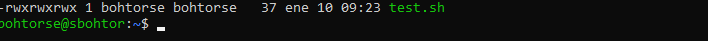

Creamos un fichero de texto el cual es .sh, esto quiere decir que es un script, que limpia la pantalla y pinta hello world.

Con chmod le damos los permisos necesarios, le he puesto 777 para hacer pruebas, pero lo suyo si no quieres tener problemas es darle menos permisos a otros, o al grupo.

Para crear los dos usuarios usamos adduser, en vez de useradd, adduser es una variante más completa, ya que te pregunta más datos, useradd es del tirón sin contraseña ni nada, tendrías que cambiarla después.

Aquí igual.

Ahora en home creamos otra carpeta llamada ncs, le damos los permisos 644, ya que es una carpeta, le puse 777 para hacer pruebas, y creamos el script hello.sh que hace lo mismo que el anterior.

Ahora una vez esté todo, tenemos que meternos en el usuario bob no nos va a dejar ejecutar el script de hello.sh porque es de mi usuario no de bob, aunque bob puede ver la carpeta, los permisos de group ni de others lo pueden ejecutar, ahora con bob creamos el script bob.sh, que hace lo mismo que el de hello.sh pero pone "hello this is bob bob", y lo metemos en la misma carpeta, smith le pasa lo mismo que a bob, puede ver la carpeta pero no puede ejecutar ningún script, ya que no tiene los suficientes permisos.

Ahora creamos el grupo sysadmins, y añadimos a bob y smith,
cambiamos el propietario del grupo de la carpeta ncs, y de los scripts, y probamos si nos funcionan la ejecución de los scripts, y funciona perfectamente, ya que son los scripts de sysadmins y bob y smith están dentro, el apartado de groups debería tener los permisos necesarios en mi caso los tenía.

Aquí podemos ver que bob pertenece a sysadmins.
sudo usermod -L bob
sudo usermod -L smith

Le hacemos un lock a un usuario, es decir lo deshabilitamos.